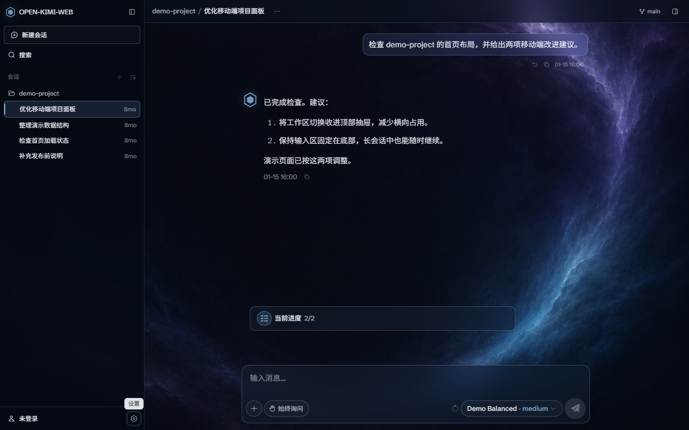
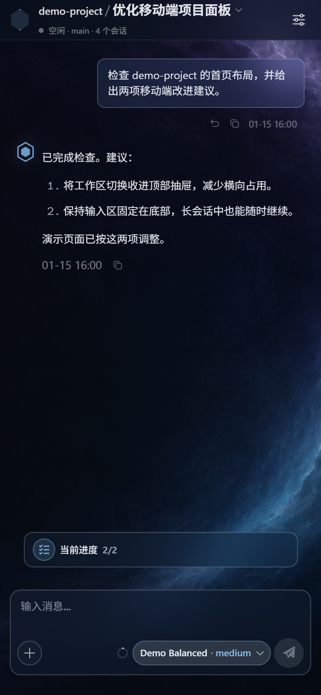
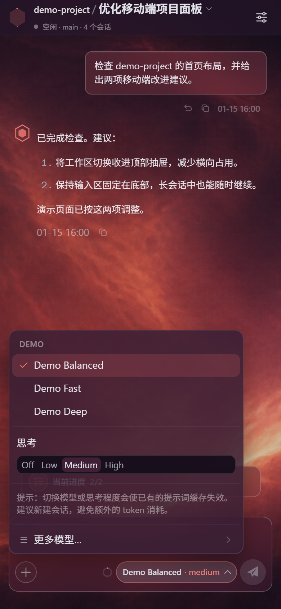
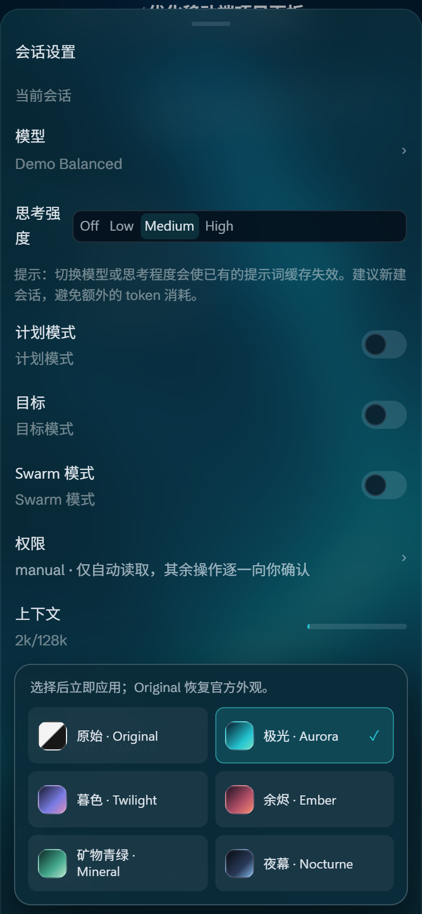
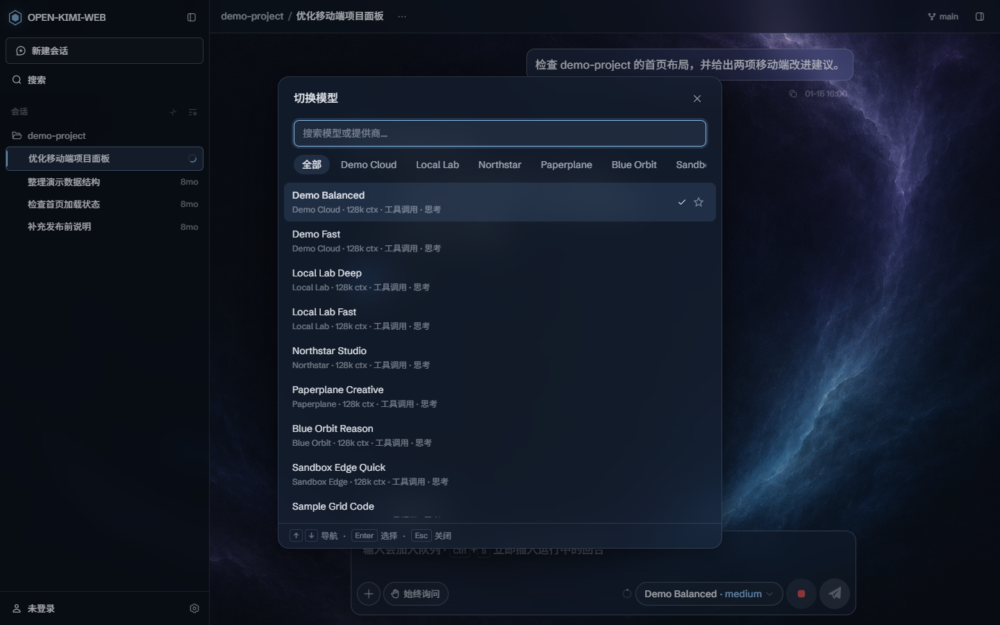
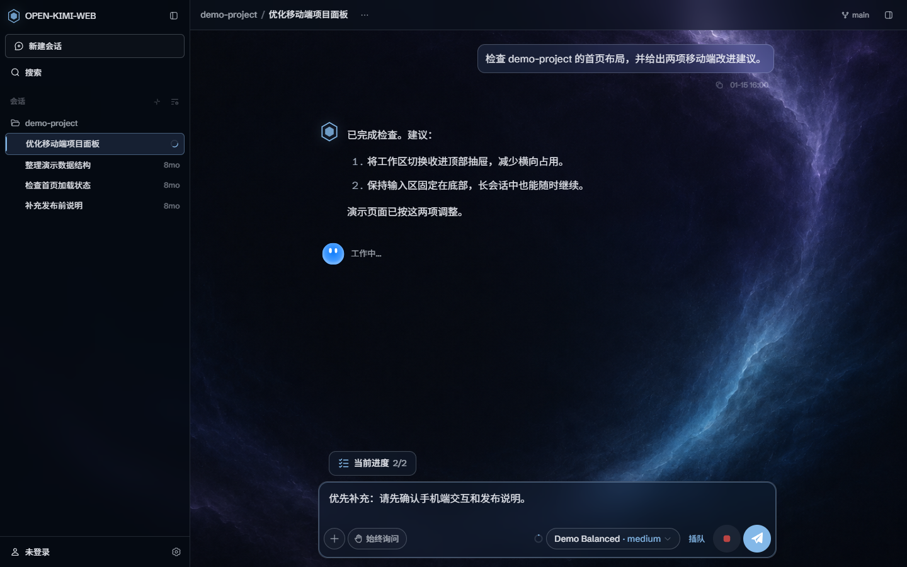
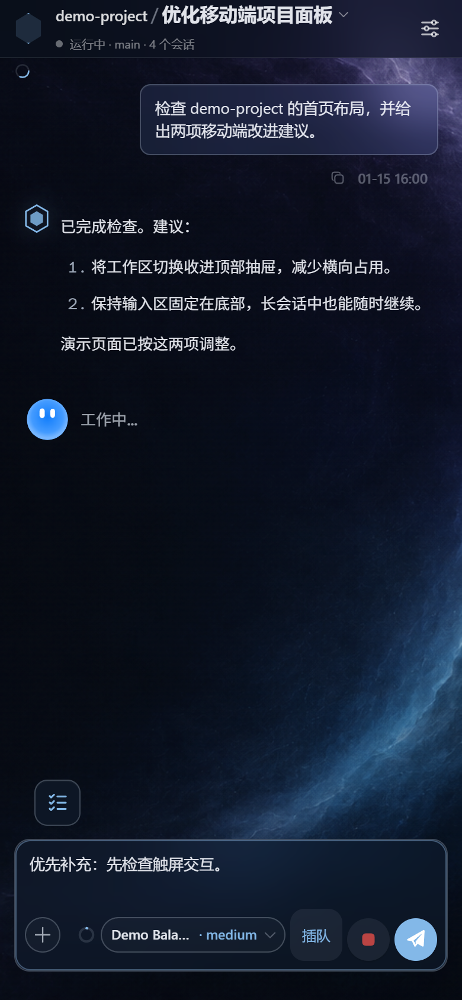

# OpenWeb for Kimi Code

**把手机变成 Kimi Code 的第二块屏幕。** Open Kimi Web 保留官方 Web 与后端，在外层补上局域网 HTTPS、token 直达链接和移动页面适配；需要时还可让 `kimi web` 走这层增强。

[![CI][ci-badge]][ci-workflow]
[](LICENSE)
[](packages/launcher/package.json)

> **这不是 Kimi Code 官方产品。** 独立的社区开源项目，与 Moonshot AI 无关联、不由其维护或背书。
> 默认界面直接来自官方 npm 包（MIT 许可）的构建产物；官方 logo 与样式版权归 Moonshot AI 所有。

## [open-kimi-web v0.42.0-r1][release-0.42.0-r1] 最新变化

版本号跟随已验证的 Kimi Code 兼容基线；`rN` 表示同一基线上的项目修订号。
本项目当前不发布到 npm registry，请从 GitHub Release 或源码明确选择版本。

- 兼容基线升级到 Kimi Code `0.42.0`，官方界面下载回退版本同步更新。
- 已归档会话改用官方永久删除接口，不再为此常态开启或代理 debug endpoints。
- 删除按钮跟随官方 `kimi-locale` 语言设置，中文界面不再显示英文删除文案。
- 为官方 Rive 动画的 `.wasm` 资源返回正确的 `application/wasm` 类型。
- 手机会话页会在任务完成、等待审批或等待回答时显示醒目弹窗，并可直接回到待处理控件。

完整版本历史见 [CHANGELOG.md](CHANGELOG.md)。从旧版本升级后需要重启 `kimi web` / launcher，
再刷新或重新打开页面；已经运行的服务不会热加载新资源。

## 相对官方 Kimi Web 的完整增强功能

- **局域网 HTTPS**：让官方 server 保持回环监听，由 launcher 提供局域网 HTTPS、
  自签名证书和 SHA-256 指纹。
- **token 直达链接**：在启动输出中提供带 `#token=...` 的 Local 与 Network 链接，
  页面挂载前移除 fragment。
- **可逆命令接管**：`integrate install` 可接管 `kimi web`，其它 `kimi` 命令原样透传；
  `status`、`repair` 和 `uninstall` 用于检查、修复和撤销接管。
- **稳定启动与诊断**：受管模式固定后端和入口端口，等待官方服务就绪，并清楚报告端口、
  工作区、后端、依赖和官方 bundle 错误。
- **移动页面适配**：改善首页、会话设置、模型菜单、工作区列表、输入区和 composer dock
  在小屏设备上的布局，并修复桌面侧栏收起后的空白。
- **手机任务强提醒**：任务完成、审批请求和提问请求会显示可关闭的弹窗；待处理弹窗可定位
  到原控件，并避免初始空闲、切换会话、历史回放和断线重连误触发。
- **五套氛围主题**：提供夜幕、极光、暮色、余烬和矿物青绿主题，覆盖桌面与手机；
  可恢复官方外观，选择只保存在当前浏览器和站点。
- **供应商编辑增强**：供应商标签支持触摸、拖动、滚轮和键盘导航；模型可配置多模态、
  工具、思考能力与思考档位，可从 `/models` 发现并添加模型，也可用鼠标或触摸排序。
- **工作区置顶**：支持置顶和取消置顶，多个置顶项按操作顺序排列；本地只保存工作区 ID。
- **归档会话删除**：已归档设置页和首页“已完成”列表提供永久删除；仅为唯一匹配项显示入口，
  二次确认后调用 Kimi Code `0.42.0` 官方删除接口。
- **发送与阅读体验**：会话运行中可在桌面和手机使用“插队”发送，桌面保留 `Ctrl+S`；
  工具调用完成后默认保持展开，已有手动偏好继续生效。
- **通知权限整流**：保留官方首次自动申请行为，合并并发请求；关闭提示后后台事件不会反复
  申请，设置中的主动重试仍可用。
- **官方界面轻量注入**：继续使用官方会话、模型和设置，将标签页及共用标题改为
  `open Kimi-Code web`；`--web-dir` 提供用户构建时不注入这些增强。

## 界面预览

以下截图来自官方 `0.41.0` 前端与本项目增强层，使用隔离浏览器和固定演示数据。`demo-project`、对话内容与 `Demo` 模型均为虚构示例，不代表真实账号或额外提供的模型服务。

**主推：夜幕 · Nocturne — 工作区、会话与对话界面**



**手机端：主推夜幕对话、极光主题切换与余烬模型菜单**

<p>
  
  
  
</p>

### 新功能展示

供应商标签超出弹窗宽度时，可直接触摸滑动或按住鼠标拖动；鼠标滚轮和键盘方向键也可横向浏览。



会话运行中输入新内容后，桌面端和手机端均可点“插队”立即发送；桌面端的 `Ctrl+S` 快捷键继续可用。

<p>
  
  
</p>

**五套主题实机预览**（夜幕为主推视觉）：

- **夜幕 · Nocturne（主推）**：[桌面](docs/images/theme-nocturne-desktop.png) ·
  [手机](docs/images/theme-nocturne-mobile.png)
- **极光 · Aurora**：[桌面](docs/images/theme-aurora-desktop.png) ·
  [手机](docs/images/theme-aurora-mobile.png)
- **暮色 · Twilight**：[桌面](docs/images/theme-twilight-desktop.png) ·
  [手机](docs/images/theme-twilight-mobile.png)
- **余烬 · Ember**：[桌面](docs/images/theme-ember-desktop.png) ·
  [手机](docs/images/theme-ember-mobile.png)
- **矿物青绿 · Mineral**：[桌面](docs/images/theme-mineral-desktop.png) ·
  [手机](docs/images/theme-mineral-mobile.png)

### 切换主题

桌面端打开左下角账号菜单，选择**氛围主题**；手机端打开**设置 → 氛围主题**。选择后立即生效：

| 主题 | 配色与背景 |
| --- | --- |
| **Nocturne · 夜幕（主推）** | 更深的墨蓝、克制的蓝紫边缘光，作为仓库主推展示风格 |
| Aurora · 极光 | 海蓝底色、青色极光与柔和光晕 |
| Twilight · 暮色 | 靛蓝底色、薰衣草紫与灰粉色暮光 |
| Ember · 余烬 | 深梅紫底色、珊瑚与蜜桃色暖光 |
| Mineral · 矿物青绿 | 深石油绿、鼠尾草与薄荷绿层次 |

初次使用默认夜幕。主题选择（包括原始外观）保存在当前浏览器、当前站点的 `localStorage` 中，
刷新后保持；已有选择不会被默认值覆盖，不同设备需要各自选择。选择原始外观会移除主题覆盖，
恢复官方浅色、深色或跟随系统设置。浏览器禁止本地存储时仍可切换，但无法保证刷新后保留。

这些主题分别使用随 launcher 附带的星云纹理，配合半透明面板、细描边、六边形标记与紧凑的手机布局。只加载当前主题的背景，无需访问外部图片服务。素材来源与生成提示见 [主题素材说明](docs/THEME-ASSETS.md)。

## 快速上手

前提：已安装官方 [Kimi Code](https://github.com/MoonshotAI/kimi-code)（`kimi web` 可用）和 Node ≥ 22。
源码安装还需要 Corepack；下载官方界面还需 PATH 中有 `curl` 和 `tar`。本项目当前不发布到
npm registry，可从 GitHub Release 的版本化 tgz 或源码安装。

**GitHub Release tgz**（固定为 `v0.42.0-r1`）：

```sh
npm install -g https://github.com/WilliamLambertCN/open-kimi-web/releases/download/v0.42.0-r1/open-kimi-web-0.42.0-r1.tgz
open-kimi-web integrate install
```

**源码：**

```sh
git clone https://github.com/WilliamLambertCN/open-kimi-web.git
cd open-kimi-web
corepack pnpm install --frozen-lockfile

# 一次性接管 kimi web
node packages/launcher/bin/open-kimi-web.mjs integrate install
```

如果 Windows 在 `corepack pnpm install` 下载 `pnpm-10.33.0.tgz` 时出现
`ECONNRESET`，先解决 Corepack 的下载链路，再运行 `integrate install`；直接跳过依赖安装
只会得到不能启动 Web 服务的 launcher。Corepack 下载 pnpm 本体时使用自己的 registry，
不会读取尚未启动的 pnpm 配置。可先重试；需要使用仓库已有的 npmmirror 回退时，
在当前 PowerShell 中同时设置 Corepack 和 pnpm 的 registry，然后按锁文件重新安装：

```powershell
$env:COREPACK_NPM_REGISTRY = 'https://registry.npmmirror.com'
$env:npm_config_registry = $env:COREPACK_NPM_REGISTRY
corepack pnpm install --frozen-lockfile
```

如果网络必须经过代理，请设置真实可用的代理地址；新版 Corepack 通过 Node 的环境代理开关
读取 `HTTPS_PROXY`：

```powershell
$env:NODE_USE_ENV_PROXY = '1'
$env:HTTPS_PROXY = 'http://127.0.0.1:<port>'
corepack pnpm install --frozen-lockfile
```

不要原样复制占位地址，也不要通过关闭完整性校验绕过下载问题。变量说明与网络排查项见
[Corepack 官方文档](https://github.com/nodejs/corepack/blob/main/README.md#environment-variables)。安装成功后再执行上面的
`integrate install`。

然后**开一个新终端**：

```sh
kimi web --host
```

终端会打印：

```text
  Local:   https://127.0.0.1:48627#token=...
  Network: https://192.168.x.x:48627#token=...   ← 手机连这个
  SHA-256 fingerprint: 9D:0A:F1:...              ← 首次访问先核对它
```

手机连同一局域网，打开 Network 链接，浏览器提示证书不受信时**核对指纹一致**再接受。搞定。

接管模式保留官方 Kimi 后端的固定回环端口 `58627`，Open Kimi Web 使用配套的固定对外端口
`48627`。如果端口已被其他程序占用，启动会明确失败；可关闭占用程序，或显式使用
`kimi web --port <port>` 更换 Open Kimi Web 的对外端口。

接管后 `open-kimi-web` 命令本体也在 PATH 上：

```sh
open-kimi-web integrate status      # 健康检查
open-kimi-web integrate repair      # 官方 kimi 升级后修一下
open-kimi-web integrate uninstall   # 撤销接管，恢复官方命令路径
```

### 升级

全局 tgz 安装更新时，再次安装上面的版本化 URL；源码安装更新时，在仓库目录执行：

```sh
git pull --ff-only
corepack pnpm install --frozen-lockfile
```

随后运行 `open-kimi-web integrate status`；仅在它报告 wrapper、PATH 或真实 `kimi` 路径异常时，
运行 `open-kimi-web integrate repair`。最后结束仍在运行的旧 `kimi web` / launcher 进程，
再执行 `kimi web --host`，否则旧进程不会加载新版本。

不想接管也行——自己先跑 `kimi web`，再运行
`node packages/launcher/bin/open-kimi-web.mjs serve --lan`，即可使用代理、HTTPS 与页面增强。

## 工作原理

接管前：

```text
手机/浏览器 ──HTTP 明文──> kimi 官方 server（绑 0.0.0.0，局域网可见）
```

接管后，同一条 `kimi web --host` 命令：

```text
手机/浏览器 ──HTTPS──> OpenWeb launcher（绑 0.0.0.0，你看到的入口）
                           │  本机回环代理，不出机器
                           ▼
                      kimi 官方 server（只听 127.0.0.1 随机端口）
```

接管通过 PATH 中的小 shim（`~/.open-kimi-web/bin/kimi[.cmd]`）实现：支持的 `web` 参数走
上面的两段式启动，其余调用交给官方二进制。Windows 安装写入 User PATH；若 System PATH
中的官方 `kimi` 排在前面，需按安装警告调整顺序，并用 `integrate status` 检查。局域网
无法直接访问被托管的真实 server；HTTPS、token 链接和指纹由 launcher 负责。

## 官方界面与手机适配

launcher **默认服务官方 `kimi-code` npm 包里的 `dist-web` 构建产物**（MIT 许可），继续使用
官方的会话、模型与设置功能。标题补丁将浏览器标签页及共用标题模板的页面顶栏改为
"open Kimi-Code web"。手机端另加独立展示层，对齐首页、会话设置、模型菜单和工作区列表。

- **首次启动需联网**：launcher 会从 npm registry 下载对应版本的包（约 20 MB，仅一次），
  自动探测版本（问 target 的 `/api/v1/meta`，失败则回落到已测版本 `0.42.0`）；先试
  npmjs，再试 npmmirror 镜像，尊重 `HTTPS_PROXY`/`HTTP_PROXY`。
- **下载校验范围**：当前检查下载、解包和必需文件是否完整；未实施独立来源的 SRI 校验，也不会在每次启动时对缓存逐文件计算哈希。
- **缓存**：解包后缓存在 `~/.open-kimi-web/official-web/<版本>/`，之后离线可用；title 补丁只在缓存时打一次，`boot.js`（官方原样）与上游 `LICENSE` 一并落盘。
- **展示层与主题**：由 launcher 在官方页面响应中加载 `src/mobile/` 的独立样式与脚本；
  既有缓存也会生效，无需重下载或修改上游缓存。资源使用 `no-cache`；布局调整仅在手机
  宽度启用，主题支持桌面与手机，侧栏品牌文字统一显示为 `OPEN-KIMI-WEB`。供应商模型
  能力通过官方 `POST/PUT /api/v1/providers` 字段保存；模型发现请求由受当前页面 bearer
  token 保护的 launcher 同源端点转发，限制为 http(s)、短超时、1 MiB 响应且不跟随
  重定向，API Key 不写日志、不回显。`--web-dir` 不注入该展示层及主题功能。已对照的
  上游构建为 `0.42.0`，未来版本若改变组件结构，需要重新检查这些选择器。
- **失败行为（兼容性变更）**：官方 bundle 不可用时 launcher 现在会明确中止启动，不再静默改用不同的界面。恢复 npm 网络与 `curl` / `tar` 后重试，或用 `--web-dir` 指向隔离且已准备好的官方前端构建目录。
- **显式指定**：`open-kimi-web serve --web-dir <path>` 直接公开并服务现成构建目录。
  不要在目录中放日志、备份、配置或凭证；静态服务会拒绝通过符号链接越过该目录。
  `--web-version <ver>` 固定官方包版本；接管后的 `kimi web` 也支持
  `OPEN_KIMI_WEB_DIR` / `OPEN_KIMI_WEB_VERSION`。

旧版内置前端已移除：请删除启动参数 `--web-ui open` 或环境变量 `OPEN_KIMI_WEB_UI=open`，使用默认官方界面。`--web-version` 仍可固定官方版本；`--web-dir` 仅用于加载自行修复后的隔离前端构建目录。

## Kimi 插件入口

仓库根目录也是一个 Kimi Code 插件，可用 `/plugins install <此仓库>` 注册
`/open-kimi-web:install|status|repair|uninstall` 四个管理命令。**安装插件只会注册这些
skill/命令，不会安装 npm launcher、启动服务或修改 PATH。** 使用前仍需单独安装 launcher。

插件与 launcher 的接管状态彼此独立：移除插件不会运行 `integrate uninstall`，也不会撤销
外部写入的 wrapper/PATH；`integrate uninstall` 只撤销接管，不会卸载 launcher 或插件。

## 安全说明

- token 直达链接 = 完整编程代理权限，**别分享**。
- 官方 UI（已核对 0.42.0）将 token 存入 `localStorage`，有效期 7 天，关闭标签页不会清除。
- 回环默认 HTTP；`--lan` / 非回环 `--host` 自动 HTTPS；`--insecure-http` 是显式降级（会打印警告）。
- 自签名证书存于 `~/.open-kimi-web/tls/`，启动时若临近过期或 SAN 缺失会自动轮换。监听所有网卡时，证书包含启动时探测到的局域网地址（含虚拟网卡）；运行期间 IP 变化后需重启 launcher，以更新证书和访问链接。
- 只代理 `/api/*`；`Authorization` 原样转发、绝不落日志；`index.html` no-cache，带 hash 的 `/assets/*` immutable。

## 开发

Node ≥ 22 + pnpm 10.33（`corepack pnpm …`，root 已锁版本）：

维护职责、官方版本边界、分支模型和验证规则见 [`AGENTS.md`](AGENTS.md)。

```sh
pnpm dev            # 直接启动 launcher，连接本机官方 Kimi 服务
pnpm dev -- --lan   # pnpm 透传参数；也可写作 pnpm dev --lan
pnpm lint           # ESLint + 复杂度硬门禁
pnpm typecheck      # TypeScript 检查
pnpm test:ut        # 单元测试（行/分支覆盖率 <70% 即失败）
pnpm test:it        # 集成测试（同上）
```

`pnpm dev` 只启动 launcher，要求官方后端已经监听在配置的 target。已经执行过
`integrate install` 时，直接用 `kimi web --host` 启动受管后端和增强层，不要再同时运行
`pnpm dev`。未接管时，先用真实的官方 Kimi 二进制启动 target；如果 `kimi` 已指向
wrapper，应调用它所记录的真实二进制，再运行 `pnpm dev`。

结构：`packages/launcher` 包含 HTTPS、REST/WS 代理、官方资源加载和手机展示层；`contracts/upstream` 保留历史协议快照作为参考。上游版本与维护边界见 [`UPSTREAM.md`](UPSTREAM.md)。

兼容性基线：CLI `0.42.0`（kimi-code `main` @
[`6954d2c8`](https://github.com/MoonshotAI/kimi-code/commit/6954d2c8bf94a5c7fc29cc6ae35b15d042cc4dcb)）；
后续官方版本仍需检查受影响的增强代码。

## License

MIT — 见 [`LICENSE`](LICENSE)。Moonshot AI 的 MIT 许可代码保留原始声明，详见
[`THIRD_PARTY_NOTICES.md`](THIRD_PARTY_NOTICES.md)。运行时下载的官方 web 前端缓存于
`~/.open-kimi-web/official-web/<版本>/`，旁边保留其 `LICENSE`。

[ci-badge]: https://github.com/WilliamLambertCN/open-kimi-web/actions/workflows/ci.yml/badge.svg
[ci-workflow]: https://github.com/WilliamLambertCN/open-kimi-web/actions/workflows/ci.yml
[release-0.42.0-r1]: https://github.com/WilliamLambertCN/open-kimi-web/releases/tag/v0.42.0-r1
