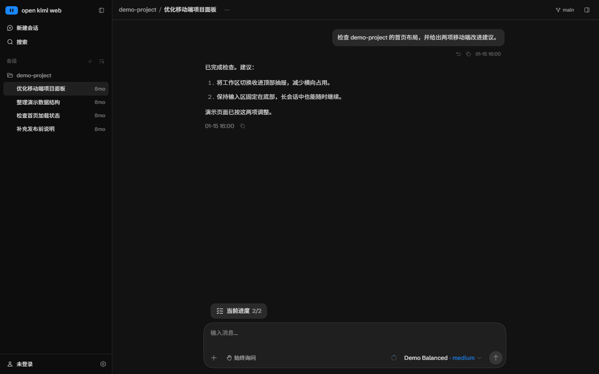
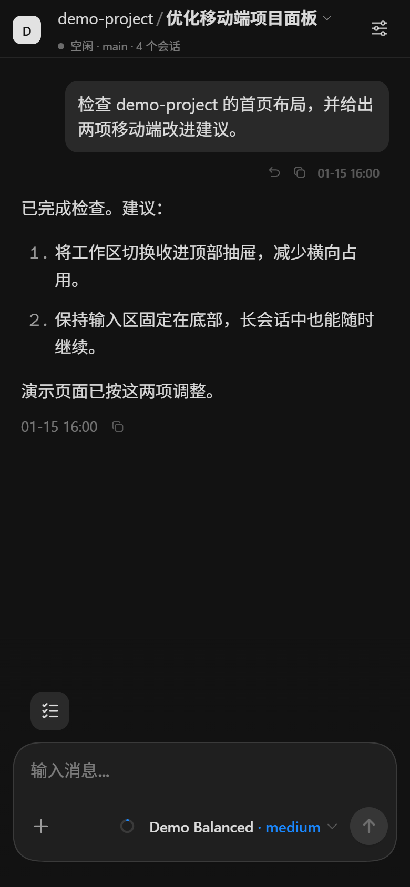
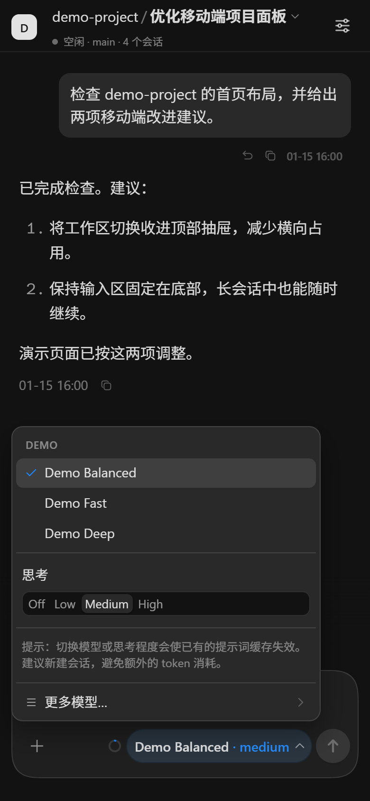
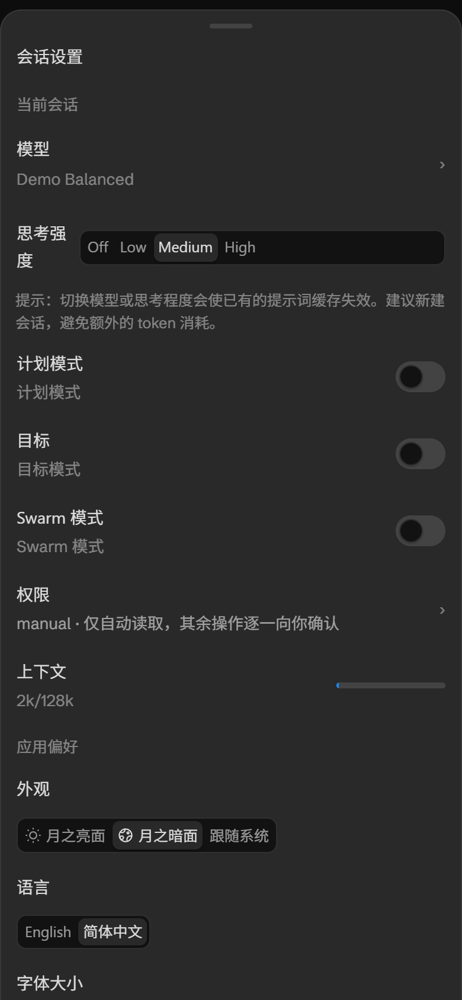

# OpenWeb for Kimi Code

**把手机变成 Kimi Code 的第二块屏幕。** Open Kimi Web 保留官方 Web 与后端，在外层补上局域网 HTTPS、token 直达链接和移动页面适配；需要时还可让 `kimi web` 走这层增强。

[](https://github.com/WilliamLambertCN/open-kimi-web/actions/workflows/ci.yml)
[](LICENSE)
[](packages/launcher/package.json)

> **这不是 Kimi Code 官方产品。** 独立的社区开源项目，与 Moonshot AI 无关联、不由其维护或背书。默认界面直接来自官方 npm 包（MIT 许可）的构建产物（见下文「官方界面与手机适配」），其中官方 logo 与样式版权归 Moonshot AI 所有。


## 界面预览

以下截图来自官方 `0.41.0` 前端与本项目增强层，使用隔离浏览器和固定演示数据。`demo-project`、对话内容与 `Demo` 模型均为虚构示例，不代表真实账号或额外提供的模型服务。

**桌面端：工作区、会话与对话界面**



**手机端：对话、模型选择与会话设置**

<p>
  
  
  
</p>

## 它能干什么

- **局域网安全开放**：`kimi web --host` 自动升级成 HTTPS——官方 server 只监听 `127.0.0.1`，launcher 在局域网入口架自签名 HTTPS，打印 SHA-256 指纹供核对。
- **token 直达链接**：打印的链接自带 `#token=...`，手机点开即用，不用手抄令牌。
- **移动页面修复**：在官方 Web 上补充小屏展示层，改善首页、会话设置、模型菜单和工作区列表的手机布局。
- **可选接管、完整可逆**：`integrate install` 可让 `kimi web` 经过本增强层；其余 `kimi` 命令原样透传官方二进制，`integrate uninstall` 可撤销 wrapper 与 PATH 改动，官方安装一个字节不动。

项目定位是官方 Web/后端的轻量增强层。未来可按需要加入个性化配置，当前版本尚未提供这项能力。维护移动补丁时优先保持改动局部，上游修复对应问题后移除补丁。

## 快速上手

前提：已安装官方 [Kimi Code](https://github.com/MoonshotAI/kimi-code)（`kimi web` 可用）、Node ≥ 22 和 Corepack。下载官方界面还需 PATH 中有 `curl` 和 `tar`。

```sh
git clone https://github.com/WilliamLambertCN/open-kimi-web.git
cd open-kimi-web
corepack pnpm install

# 一次性接管 kimi web
node packages/launcher/bin/open-kimi-web.mjs integrate install
```

然后**开一个新终端**：

```sh
kimi web --host
```

终端会打印：

```text
  Local:   https://127.0.0.1:4173#token=...
  Network: https://192.168.x.x:4173#token=...   ← 手机连这个
  SHA-256 fingerprint: 9D:0A:F1:...              ← 首次访问先核对它
```

手机连同一局域网，打开 Network 链接，浏览器提示证书不受信时**核对指纹一致**再接受。搞定。

接管后 `open-kimi-web` 命令本体也在 PATH 上：

```sh
open-kimi-web integrate status      # 健康检查
open-kimi-web integrate repair      # 官方 kimi 升级后修一下
open-kimi-web integrate uninstall   # 撤销接管，恢复官方命令路径
```

不想接管也行——自己先跑 `kimi web`，再 `node packages/launcher/bin/open-kimi-web.mjs serve --lan`，效果相同（详见 [`packages/launcher/README.md`](packages/launcher/README.md)）。

## 工作原理

接管前：

```text
手机/浏览器 ──HTTP 明文──> kimi 官方 server（绑 0.0.0.0，局域网可见）
```

接管后，同一条 `kimi web --host` 命令：

```text
手机/浏览器 ──HTTPS──> OpenWeb launcher（绑 0.0.0.0，你看到的入口）
                           │  本机回环代理，不出机器
                           ▼
                      kimi 官方 server（只听 127.0.0.1 随机端口）
```

接管通过 PATH 中的一个小 shim（`~/.open-kimi-web/bin/kimi[.cmd]`）实现：支持的 `web` 参数走上面的两段式启动，其余调用交给官方二进制。Windows 安装写入 User PATH；若 System PATH 中的官方 `kimi` 排在前面，需按安装警告调整顺序，并用 `integrate status` 检查。局域网上扫不到被托管的真实 server，HTTPS、token 链接和指纹由 launcher 负责。

## 官方界面与手机适配

launcher **默认服务官方 `kimi-code` npm 包里的 `dist-web` 构建产物**（MIT 许可），继续使用官方的会话、模型与设置功能。标题补丁将浏览器标签页及共用标题模板的页面顶栏改为 "open Kimi-Code web"。手机端另加独立的展示层，按参考界面对齐首页、会话设置、模型菜单和工作区列表；因此手机界面包含本项目的布局调整，不应称为未经修改的官方界面。

- **首次启动需联网**：launcher 会从 npm registry 下载对应版本的包（约 20 MB，仅一次），自动探测版本（问 target 的 `/api/v1/meta`，失败则回落到已测版本 `0.41.0`）；先试 npmjs，再试 npmmirror 镜像，尊重 `HTTPS_PROXY`/`HTTP_PROXY`。
- **下载校验范围**：当前检查下载、解包和必需文件是否完整；未实施独立来源的 SRI 校验，也不会在每次启动时对缓存逐文件计算哈希。
- **缓存**：解包后缓存在 `~/.open-kimi-web/official-web/<版本>/`，之后离线可用；title 补丁只在缓存时打一次，`boot.js`（官方原样）与上游 `LICENSE` 一并落盘。
- **手机展示层**：由 launcher 在官方页面响应中加载 `src/mobile/` 的独立样式与脚本；既有缓存也会生效，无需重下载或修改上游缓存。资源使用 `no-cache`；布局调整仅在手机宽度启用，侧栏品牌文字在桌面和手机侧栏统一显示为 `open kimi web`；`--web-dir` 不注入该展示层。已对照的上游构建为 `0.41.0`，未来版本若改变组件结构，需要重新检查这些选择器。
- **失败行为（兼容性变更）**：官方 bundle 不可用时 launcher 现在会明确中止启动，不再静默改用不同的界面。恢复 npm 网络与 `curl` / `tar` 后重试，或用 `--web-dir` 指向你已准备好的官方前端构建。
- **显式指定**：`open-kimi-web serve --web-dir <path>` 直接服务现成构建目录（优先级最高）；`--web-version <ver>` 固定官方包版本。接管后的 `kimi web` 使用环境变量 `OPEN_KIMI_WEB_DIR` / `OPEN_KIMI_WEB_VERSION` 选择目录或版本。

旧版内置前端已移除：请删除启动参数 `--web-ui open` 或环境变量 `OPEN_KIMI_WEB_UI=open`，使用默认官方界面。`--web-version` 仍可固定官方版本；`--web-dir` 用于加载自行修复后的官方构建。

## Kimi 插件入口

仓库根目录也是一个 Kimi Code 插件，可用 `/plugins install <此仓库>` 注册 `/open-kimi-web:install|status|repair|uninstall` 四个管理命令。**安装插件只会注册这些 skill/命令，不会安装 npm launcher、启动服务或修改 PATH。** 使用管理命令前，仍需单独安装 `open-kimi-web` launcher。

插件与 launcher 的接管状态彼此独立：移除插件不会运行 `integrate uninstall`，也不会撤销外部写入的 wrapper/PATH；`integrate uninstall` 只撤销接管，不会卸载 launcher 或插件。若两者都要移除，请分别处理。

## 安全说明

- token 直达链接 = 完整编程代理权限，**别分享**。
- 官方 UI（已核对 0.41.0）将 token 存入 `localStorage`，有效期 7 天，关闭标签页不会清除。
- 回环默认 HTTP；`--lan` / 非回环 `--host` 自动 HTTPS；`--insecure-http` 是显式降级（会打印警告）。
- 自签名证书存于 `~/.open-kimi-web/tls/`，启动时若临近过期或 SAN 缺失会自动轮换。监听所有网卡时，证书包含启动时探测到的局域网地址（含虚拟网卡）；运行期间 IP 变化后需重启 launcher，以更新证书和访问链接。
- 只代理 `/api/*`；`Authorization` 原样转发、绝不落日志；`index.html` no-cache，带 hash 的 `/assets/*` immutable。

## 开发

Node ≥ 22 + pnpm 10.33（`corepack pnpm …`，root 已锁版本）：

```sh
pnpm dev            # 直接启动 launcher，连接本机官方 Kimi 服务
pnpm lint           # ESLint + 复杂度硬门禁
pnpm typecheck      # TypeScript 检查
pnpm test:ut        # 单元测试（分支覆盖率 <60% 即失败）
pnpm test:it        # 集成测试（同上）
```

结构：`packages/launcher` 包含 HTTPS、REST/WS 代理、官方资源加载和手机展示层；`contracts/upstream` 保留历史协议快照作为参考。上游版本与维护边界见 [`UPSTREAM.md`](UPSTREAM.md)。

兼容性基线：CLI `0.41.0`（kimi-code `main` @ [`f9ca3337`](https://github.com/MoonshotAI/kimi-code/commit/f9ca33376604ae91ea35a4ac1d6f1d4425a5aead)）；后续官方版本仍需检查受影响的增强代码。

## License

MIT — 见 [`LICENSE`](LICENSE)。含 Moonshot AI 的 MIT 许可代码，原始声明完整保留（[`THIRD_PARTY_NOTICES.md`](THIRD_PARTY_NOTICES.md)）。运行时按版本下载的官方 web 前端（`@moonshot-ai/kimi-code` 的 `dist-web`，缓存于 `~/.open-kimi-web/official-web/`，旁边保留其 `LICENSE`）同样属于 Moonshot AI 的 MIT 许可代码，launcher 对标签页和共用模板的顶栏标题打补丁。
