# Open Kimi Web

在手机和电脑的浏览器里使用官方 Kimi Code，补充移动操作、模型用量统计和主题。

## 界面预览


下列截图使用基于官方 `0.41.0` 的旧版界面，当前按钮和布局细节可能不同；图中均为虚构演示数据。

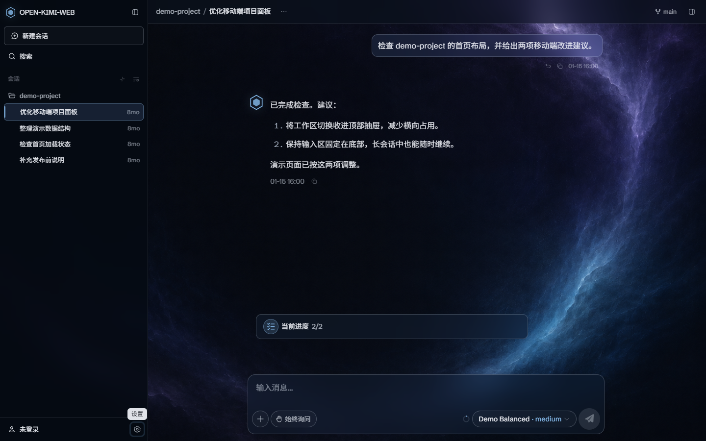

<p>
  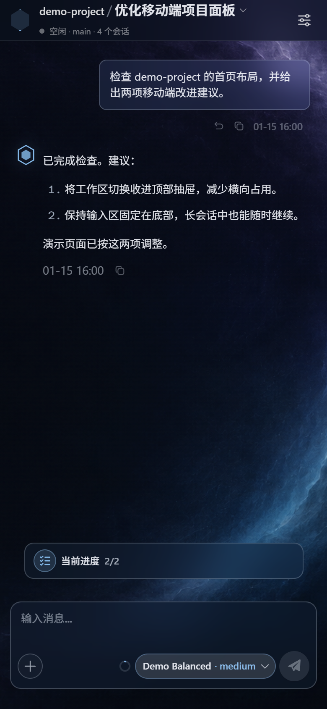
  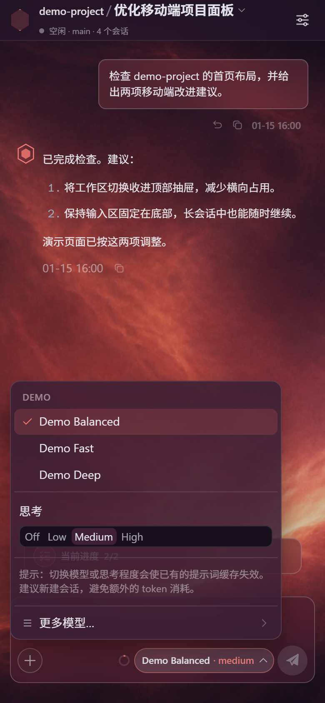
  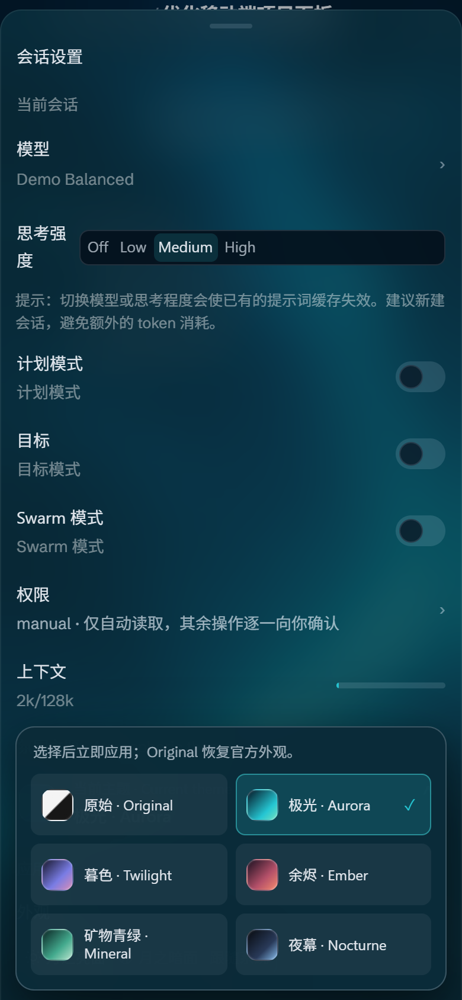
</p>

<details>
<summary>更多操作与主题截图</summary>

选择模型时，可以用手指滑动、鼠标拖动、滚轮或键盘浏览不同服务商的标签。

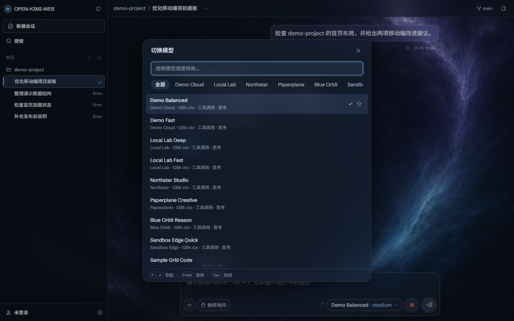

以下旧版截图包含 OKW 曾添加的“插队”按钮。新版已移除重复按钮，发送与插队使用官方界面。

<p>
  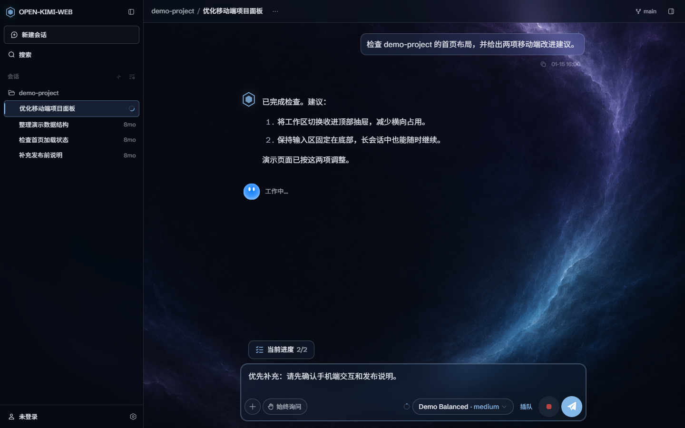
  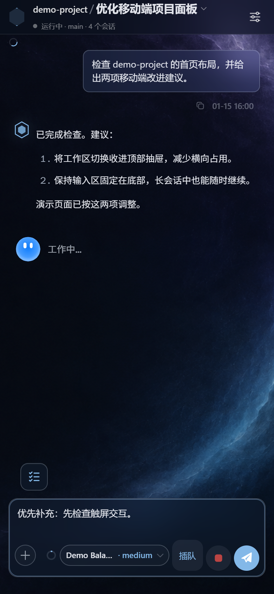
</p>

- 夜幕：[桌面](docs/images/theme-nocturne-desktop.png) · [手机](docs/images/theme-nocturne-mobile.png)
- 极光：[桌面](docs/images/theme-aurora-desktop.png) · [手机](docs/images/theme-aurora-mobile.png)
- 暮色：[桌面](docs/images/theme-twilight-desktop.png) · [手机](docs/images/theme-twilight-mobile.png)
- 余烬：[桌面](docs/images/theme-ember-desktop.png) · [手机](docs/images/theme-ember-mobile.png)
- 矿物青绿：[桌面](docs/images/theme-mineral-desktop.png) · [手机](docs/images/theme-mineral-mobile.png)

</details>

## 快速上手

> 非官方社区项目，与 Moonshot AI 无关联。[v2.6.1-r2][current-release] 适配 Kimi Code `2.6.1`，保留 `2.6.0` 支持。
> 不自动升级已有官方 Kimi。具体功能和限制见 [兼容说明](UPSTREAM.md#kimi-code-260261-adaptation)。

**Windows：打开 PowerShell，粘贴运行。**

```powershell
& {
  $api = 'https://api.github.com/repos/WilliamLambertCN/open-kimi-web/commits/v2.6.1-r2'
  $sha = (Invoke-RestMethod $api -ErrorAction Stop).sha
  if ($sha -notmatch '^[0-9a-fA-F]{40}$') { throw 'Invalid release commit SHA' }
  $url = "https://raw.githubusercontent.com/WilliamLambertCN/open-kimi-web/$sha/scripts/install.ps1"
  & ([scriptblock]::Create((Invoke-RestMethod $url -ErrorAction Stop))) --revision $sha --version 2.6.1-r2
}
```

**macOS / Linux：打开终端，粘贴运行。**

```sh
(
  set -eu
  api='https://api.github.com/repos/WilliamLambertCN/open-kimi-web/commits/v2.6.1-r2'
  metadata=$(curl --fail --silent --show-error --proto '=https' --tlsv1.2 "$api")
  sha=$(printf '%s\n' "$metadata" | sed -n 's/^[[:space:]]*"sha":[[:space:]]*"\([0-9a-fA-F]*\)".*/\1/p' | head -n 1)
  case "$sha" in ''|*[!0-9a-fA-F]*) exit 1 ;; esac
  [ "${#sha}" -eq 40 ] || exit 1
  url="https://raw.githubusercontent.com/WilliamLambertCN/open-kimi-web/$sha/scripts/install.sh"
  script=$(curl --fail --silent --show-error --proto '=https' --tlsv1.2 "$url") &&
    sh -c "$script" install.sh --revision "$sha" --version 2.6.1-r2
)
```

电脑上已有可用的 Kimi 就继续复用，不重新下载或升级；没有时才下载。损坏或无法识别的安装会报错，不直接覆盖。
脚本按需准备 Node.js、npm 和 Windows Git Bash，需要联网，不用预装 Corepack 或 pnpm。
默认配置命令入口，原来的 CLI、配置和会话继续可用；首次登录由你完成，安装不会启动服务。

安装完成后，新开终端启动：

```sh
kimi web --host
```

手机连接同一局域网，打开终端打印的 **Network** 链接。首次遇到证书警告，先与终端核对 SHA-256 指纹。
**链接含登录凭据（token），拿到它的人能读写文件、执行命令。不要分享。**
默认端口 `48627`，被占用时用 `kimi web --port <port>` 更换。
[npm 安装及更多命令](packages/launcher/README.md#安装)

### 源码安装（Windows PowerShell / macOS / Linux）

需先准备 Node.js ≥ 22、Git、Corepack 和可运行的官方 Kimi；官方 npm 版需 Node.js ≥ 22.19.0，Windows 还需 Git Bash。

```sh
git clone --branch main https://github.com/WilliamLambertCN/open-kimi-web.git
cd open-kimi-web
corepack pnpm install --frozen-lockfile
node packages/launcher/bin/open-kimi-web.mjs integrate install
```

已有源码时，在原仓库目录执行最后两条命令，不必重新克隆；安装直接使用该目录的当前代码，无需构建前端。
已有其它安装时，按[切换说明](packages/launcher/README.md#升级)处理。
安装后新开终端运行 `kimi web --host`；源码目录需要保留，安装不会启动或重启服务，也不升级官方 Kimi。

## 有哪些增强

- **手机操作**：搜索会话、输入目录路径创建工作空间、平铺所有会话并选择排序，为子代理选择模型。
- **会话菜单**：电脑三个点打开原生 Fork／分叉菜单；手机三个点可分叉、置顶或取消置顶，
  已置顶会话在列表顶部“已置顶／Pinned”区。置顶只留在本浏览器、同一站点，不跨 IP 同步。
  仍可置顶工作区、按最近活动排序，分叉会话保留 `Fork:` 标记；归档会话永久删除前会再次确认。
  [菜单操作与草稿保护](packages/launcher/README.md#会话三个点菜单)
- **阅读与提醒**：聊天区随窗格宽度调整，显示会话记录大小和消息时间，完整预览图片，切换标签先显示加载状态。
  手机可点消息目录跳转旧消息，并显示完成、审批和提问提醒；提问卡片可拉高，发送和插队沿用官方操作。
- **模型与主题**：从服务商获取模型后选择添加，调整顺序、能力与思考强度，Max 放最后，不自动改写已有配置。
  可选五套主题或恢复官方外观；电脑从账号菜单、手机从设置进入“氛围主题”。
- **请求与侧聊**：在每次回复或工具过程后查看 TTFT、包含等待的平均 TPS 和缓存命中率；侧聊可单独选模型。
  指标按实际代码结构启用；`2.6.0`／`2.6.1` 已适配新版会话接口，见 [兼容说明](UPSTREAM.md)。
- **连接**：HTTPS、Hyper-V 地址识别和传输压缩；源码与 npm 安装均可更新，也能恢复原命令入口。
  桌面“设置 → 通用”和手机会话设置可重启受管服务，忙碌时拒绝，不自动重发消息。

启动加 `--scheduled-tasks` 才显示定时任务。官方 `2.4.1`／`2.5.2`／`2.6.0`／`2.6.1` 仅可查看任务与已有历史，不能编辑、暂停或单独选模型，
也不能与同一 Kimi 服务的官方 Remote Control 同时开启。[使用限制](packages/launcher/README.md#统一导航与会话搜索)

## 安装到手机桌面

手机打开会话／工作区列表，点 **安装到桌面**；电脑侧栏也有入口。

- **Android／电脑**：浏览器支持时直接点“安装”，否则按面板提示从浏览器菜单操作。
- **iPhone／iPad**：Safari“分享”→“添加到主屏幕”；若有“作为 Web App 打开”，保持开启。
- 需设备信任的 HTTPS，跳过证书警告不一定能安装。安装后仍需联网访问正在运行的 Kimi，不能离线聊天，登录方式不变。

`2.4.1-r3` 起支持[局域网证书指引](packages/launcher/README.md#局域网证书)：
电脑沿用 Open Kimi Web 的数据目录（未改过就用默认值），运行一次 `open-kimi-web tls setup`，再自行重启服务。
手机核对电脑终端显示的证书指纹，由本人导入根证书，再重开 Chrome；不会自动修改设备信任。
证书可信也不保证所有安卓设备都能安装；局域网和 EasyTier 地址仍分别登录，桌面图标不会自动切换地址。

<table>
  <tr><th>中文 · 极光主题</th><th>English · 夜幕主题</th></tr>
  <tr>
    <td align="center">
      <a href="docs/images/feature-pwa-install-zh.png">
        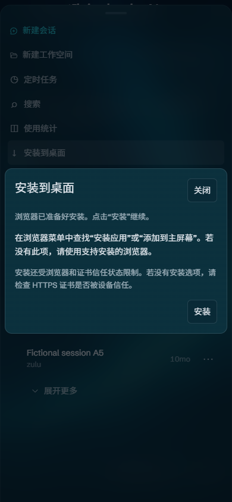
      </a>
    </td>
    <td align="center">
      <a href="docs/images/feature-pwa-install-en.png">
        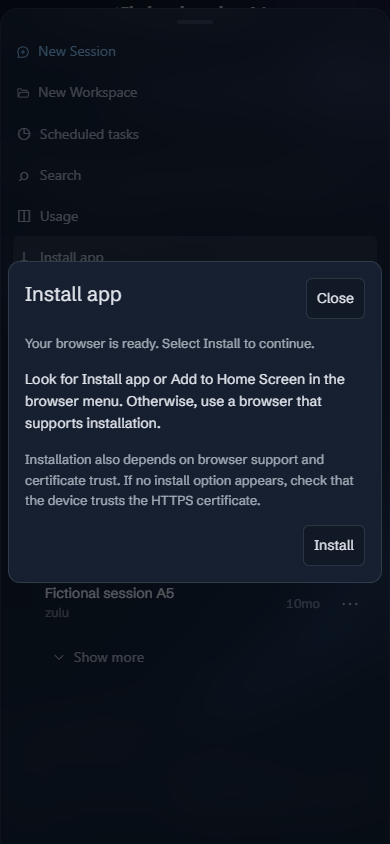
      </a>
    </td>
  </tr>
</table>

以上安装面板使用虚构数据，不代表实体手机已完成安装。点击可查看原图。

## 模型用量与 API 成本统计

在电脑侧栏或手机会话列表点 **使用统计**，按日期、模型或工作区查看 token、缓存命中和估算费用。
支持自动匹配、批量确认和手填单价；读取本机用量，按 API 单价估算，不是服务商账单。
需用本工具的 `kimi web` 启动，独立 `serve --target` 不提供本机用量。

<table>
  <tr><th width="65%">桌面端</th><th width="35%">手机端</th></tr>
  <tr>
    <td align="center" valign="top">
      <a href="docs/images/feature-usage-desktop.png">
        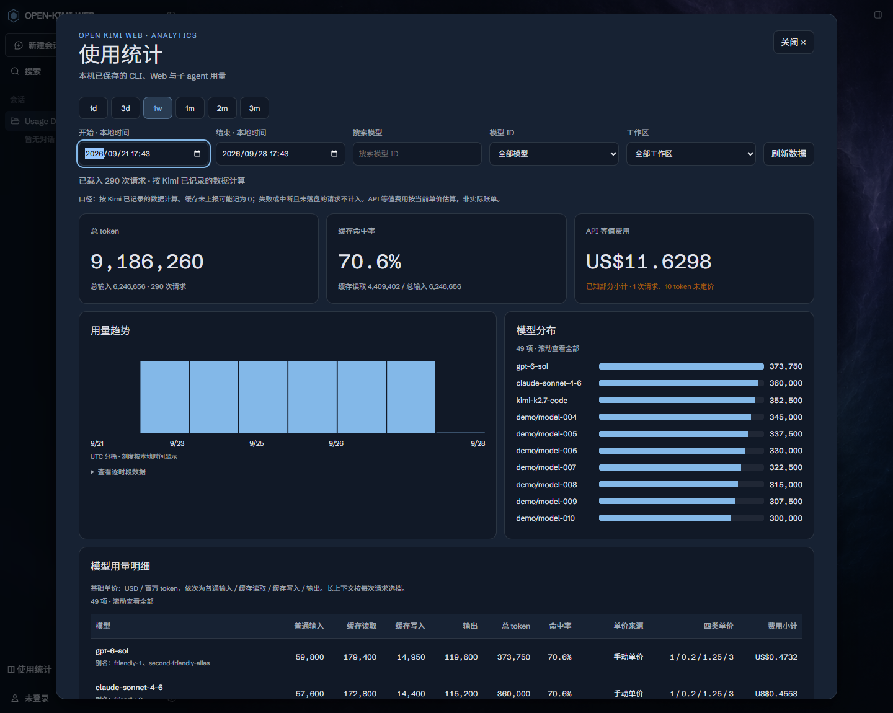
      </a>
    </td>
    <td align="center" valign="top">
      <a href="docs/images/feature-usage-mobile.png">
        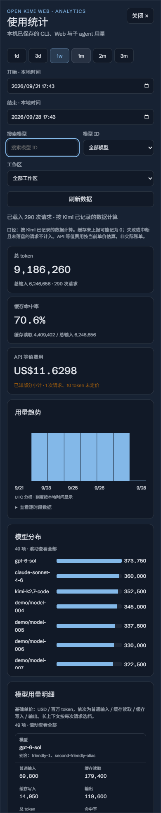
      </a>
    </td>
  </tr>
  <tr>
    <td align="center" valign="top">
      <a href="docs/images/feature-usage-pricing-desktop.png">
        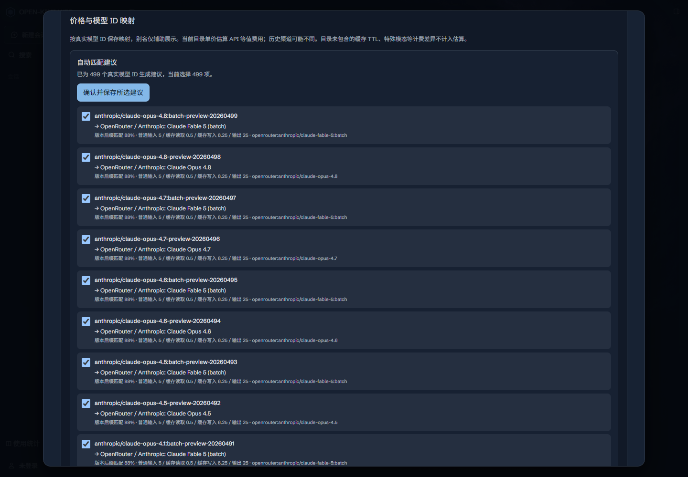
      </a>
    </td>
    <td align="center" valign="top">
      <a href="docs/images/feature-usage-pricing-mobile.png">
        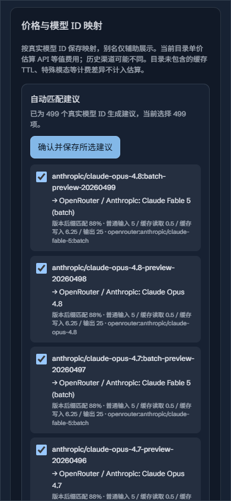
      </a>
    </td>
  </tr>
</table>

## 升级

```sh
open-kimi-web update --check
open-kimi-web update
```

源码仓库已清理提交历史。旧克隆不能直接快进更新；先保留本地改动，再重新克隆，不要强制覆盖。
一键／npm 安装不受历史清理影响，正常升级即可；旧版下载包已撤下，请使用最新版。

只更新当前使用的 Open Kimi Web，不升级官方 Kimi、不修改会话或自动重启。
完成后停止旧服务，重新运行 `kimi web --host`，再刷新网页。
[源码升级、切换目录或安装方式](packages/launcher/README.md#升级)

## 常见问题

- **手机打不开？** 核对网络、防火墙和终端地址；电脑 IP 变化后需重启服务。
- **更新后没变化？** 新文件不会替换旧进程，需重启服务并刷新网页。
- **Tower 没入口？** 官方多代理协作实验默认关闭。[开启条件与风险](packages/launcher/README.md#推理档位与原生-tower)
- **大会话仍慢？** 最近页和压缩不消除后端读取、浏览器解析与显示成本，不保证秒开。
  可加 `--debug` 排查。[日志说明](packages/launcher/README.md#慢加载诊断)
- **恢复原命令？** 运行 `open-kimi-web integrate uninstall`，只撤销本工具入口，不卸载软件。
  原 Kimi 已在 PATH 中则继续可用，否则仍需完整路径。
- **自定义网页？** `--web-dir` 不添加本项目增强；目录会对外服务，勿放凭据、配置、日志或备份。

## 更多文档

- [完整安装与命令](packages/launcher/README.md) · [更新日志](CHANGELOG.md) · [官方版本兼容](UPSTREAM.md)
- [维护与开发](AGENTS.md) · [主题素材](docs/THEME-ASSETS.md)
- [Kimi 插件管理](skills/open-kimi-web/SKILL.md)：安装插件不会自动安装或启动服务。

[![CI][ci-badge]][ci-workflow]
[](LICENSE)

MIT 许可，见 [LICENSE](LICENSE) 和 [第三方声明](THIRD_PARTY_NOTICES.md)。

[ci-badge]: https://github.com/WilliamLambertCN/open-kimi-web/actions/workflows/ci.yml/badge.svg
[ci-workflow]: https://github.com/WilliamLambertCN/open-kimi-web/actions/workflows/ci.yml
[current-release]: https://github.com/WilliamLambertCN/open-kimi-web/releases/tag/v2.6.1-r2
